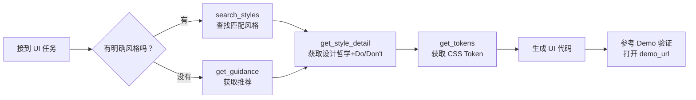

# Design Atlas — Agent 接入设置指南

> 让 Claude Code、Cursor、Codex 等 AI 编码工具可以直接使用 Design Atlas 的设计风格。

## 前置条件

- Python 3.11+
- 已 clone `design-atlas` 仓库到本地

## 接入方式

### 方式一：MCP Server（推荐，支持实时查询）

MCP Server 提供 6 个工具，让 Agent 在设计开发过程中实时搜索和获取设计风格信息。

**启动 Server：**
```bash
python3 /path/to/design-atlas/server/mcp_server.py
```

Server 会在 stdio 模式下持续运行，接收 JSON-RPC 请求。

### 方式二：Agent Skill（静态引用，无需额外服务）

Skill 文件已位于以下三端兼容位置（symlinked）：

| 路径 | 兼容工具 |
|------|---------|
| `.agents/skills/design-atlas/SKILL.md` | 所有工具（推荐标准位置） |
| `.claude/skills/design-atlas/SKILL.md` | Claude Code |
| `.cursor/skills/design-atlas/SKILL.md` | Cursor |

> 如果你在自己的项目中使用 Design Atlas，请在项目根目录创建 `.agents/skills/` 并运行：
> ```bash
> git submodule add https://github.com/luogao/design-atlas design-atlas
> ln -sf $(pwd)/design-atlas/.agents/skills/design-atlas .agents/skills/design-atlas
> ```

---

## 各工具的详细配置

### Claude Code

**MCP 配置（推荐）：**
```bash
# 使用 Claude CLI 添加 MCP server
claude mcp add --transport stdio design-atlas python3 /path/to/design-atlas/server/mcp_server.py
```

**或者手动编辑 `.mcp.json`（项目根目录）：**
```json
{
  "mcpServers": {
    "design-atlas": {
      "type": "stdio",
      "command": "python3",
      "args": ["/ABSOLUTE/PATH/TO/design-atlas/server/mcp_server.py"],
      "env": {}
    }
  }
}
```

**Skill 文件位置：** Claude Code 会自动检测 `.claude/skills/` 目录。

---

### Cursor

**MCP 配置：**
在 Cursor 中：
1. 打开 **Settings → Cursor Settings → MCP**
2. 点击 **Add New MCP Server**
3. 填写：
   - Name: `design-atlas`
   - Type: `stdio`
   - Command: `python3 /ABSOLUTE/PATH/TO/design-atlas/server/mcp_server.py`

**Skill 文件位置：** Cursor 会自动扫描 `.cursor/skills/` 目录。

**或者使用 `.cursor/rules/`（更推荐）：**
在 `.cursor/rules/design-atlas.mdc`：
```yaml
---
description: Design Atlas 设计风格知识库指引
globs: *.css, *.tsx, *.jsx, *.html
alwaysApply: false
---
加载 design-atlas SKILL.md（位于 .cursor/skills/design-atlas/SKILL.md）获取完整指引。
```

---

### Codex CLI (OpenAI)

**Skill 文件：** Codex CLI 会自动检测 `.codex/skills/` 目录，也支持 `.claude/skills/` 和 `.cursor/skills/` 以保持兼容。

**或者使用 AGENTS.md：**
将以下内容添加到项目根目录的 `AGENTS.md`：
```markdown
## Design Atlas 设计风格库

本项目使用 Design Atlas（位于 design-atlas/ 目录）作为设计风格参考。
Agent 在执行 UI 任务前，请先搜索并匹配 Design Atlas 中的设计风格。

设计风格搜索请使用 MCP 工具（通过 config.toml 配置），或读取 design-atlas/.agents/skills/design-atlas/SKILL.md 获取风格摘要。
```

---

## 工作流程

当 Agent 被要求创建 UI 时：



### 示例 Prompt

用户说："帮我做一个复古游戏排行榜页面"

Agent 应该：
1. 调用 `get_guidance("游戏排行榜页面")` → 推荐 NES.css
2. 调用 `get_style_detail("ext-nes-css")` → 获取 Do/Don't
3. 调用 `get_tokens("ext-nes-css")` → 获取 CSS 变量
4. 根据指引生成 NES.css 风格的页面

## 注意事项

- MCP Server 需要 Python 3.11+ 和 `mcp` 包（`pip install mcp`）
- `.mcp.json` 路径必须是**绝对路径**（MCP 运行时不解析相对路径）
- 如果使用 git submodule，每次更新 submodule 后 MCP Server 会自动读取最新数据
- STDIO 模式下，MCP Server 的日志输出（stderr）不会影响 JSON-RPC 通信
